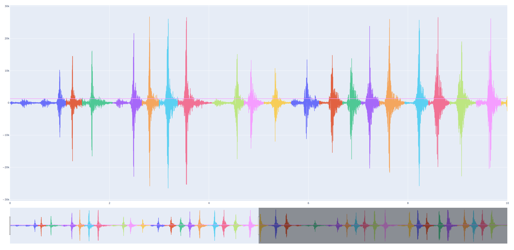

# wheremypeepsat

## What does it do?
Given a sound input, it segments the sound-input into segments separated by
silence.
Then counts the segments and outputs the amount of segments.

## Okay, but why does it do that?
In behavioral research with fowl one sometimes do what's called a peep-test.
Where you need to count the number of times a bird peeps during a time-period.
Manual counting is not particularly reliable or repeatable.
For instance like in [this paper](https://liu.diva-portal.org/smash/record.jsf?dswid=-8294).

## Settings
The tool can be run from the commandline using the following command:
`python WhereMyPeepsAt.py soundFile.wav --start 1500 --end 61500 --feedback`
This will parse one minute of the soundfile.wav, starting at 1500 ms and at the
end of the sound-file it will present a feedback image of the sound splitting.

### Navigating the feedback image
One can use the arrow-keyes to navigate the feedback image and jump 10 seconds
of signal at a time. This is useful for manual inspection of the results.

### Additional settings

#### Silence Level
`--sil 86` overrides the silence level
Normally the tool calculates a suitable silence level. This is set to 10 dB
below the sound files [dBFS](https://en.wikipedia.org/wiki/DBFS).

If for some reason this is not suitable, this can be set manually using the
above setting. In the feedback image a horizontal line is rendered,
representing the silence level being used. The interpretation of this line is
not always immediately straightforward as the audio split is checking the RMS
in a window is above of below this level. In other words it's not enough that
the signal momentarily rises above this threshold. It needs to be above it for
a while. For details see
[pydub](https://github.com/jiaaro/pydub/blob/master/pydub/silence.py).

#### Statistical splitting
The tool uses a statistical splitting model for detecting sounds that are
distinctly different, but occur so rapidly that the sound level never drops
below the silence threshold for long enough. This is done by assuming that
each sound detected should have roughly the same length. Then statistical
outliers are found and by checking their length compared to the average length
if they are 2,3,4, etc extra sound splits.

## Getting started

The process of using the tool usually follows the following flow.
1) Video is recorded and transferred to ones PC
2) From the video extract the audio.
This can be done with for instance FFMPEG. From a commandline use `ffmpeg -i video.mov sound.wav`.
3) Use the python tool from a commandline prompt, as shown above in the settings section.

### Linux
1) Install python and ffmpeg using, for instance apt.
2) Launch a `terminal` and use ffmpeg to extract sound from the video and then proceed with using the counting tool.

### Mac
Follow similar instructions as linux, but use homebrew instead for installation.

### Windows
Download this whole repository, which is most easily done under "Releases" found to the right on the github page.

#### Python
Go to the Python website (https://www.python.org/) and click on the "Downloads"
tab.

Under the "Python Releases for Windows" heading, click on the link for the
latest version of Python 3 (Python 3.10.0 as of September 2021).

A new page will open with the download options for Python. Click on the
"Windows x86-64 executable installer" link to download the Python installer.

Once the download is complete, double-click on the downloaded .exe file to
start the installation process.

Follow the prompts in the installation wizard to complete the installation.
Make sure to check the box to "Add Python 3.X to PATH" during the installation
process. This will allow you to run Python from the command prompt.

Once the installation is complete, open the command prompt by typing "cmd" into
the search bar and hitting Enter.

In the command prompt, type "python" and hit Enter. If the installation was
successful, you should see the Python prompt appear, indicating that Python is
ready to use.

That's it! You now have Python 3 installed and ready to use on your Windows
machine.

In addition you now have pip which will be needed for installing dependencies.

#### Dependencies

From a command prompt (cmd) navigate to the downloaded repository. `cd "path to repository"` then run
`pip install -r pip/requirements.txt` to install all the dependencies that the tool requires.

#### FFMPEG

Download and install ffmpeg. You can download the latest version of ffmpeg from
the official website at https://www.ffmpeg.org/. Once the download is complete,
double-click the installation file and follow the prompts to install ffmpeg on
your system.

Open the command prompt. You can do this by clicking on the Start menu and
searching for "cmd" or by pressing the Windows key + R and typing "cmd" into
the Run dialog box.

Navigate to the folder where you have installed ffmpeg. You can use the cd
command to change directories. For example, if you installed ffmpeg in the
"C:\Program Files\ffmpeg" folder, you would type cd C:\Program Files\ffmpeg
into the command prompt and press Enter.

Run ffmpeg commands. Once you are in the correct folder, you can run ffmpeg
commands by typing "ffmpeg" followed by the desired options and arguments. For
example, to convert a video file from one format to another, you would type
`ffmpeg.exe -i input.mp4 output.wav` and press Enter.

I hope this helps! Let me know if you have any questions or if you would like
more information on using ffmpeg.

#### Running it all

1) Open a command prompt, win-key + type cmd.
2) Navigate to the repository where you downloaded it. `cd "path to downloaded repository"`
3) Run the tool `python WhereMyPeepsAt.py soundFile.wav --start 1500 --end 61500 --feedback`
This assumes that the soundFile.wav is placed in the same directory. You can of course place it somewhere else and
specify the path to there instead.

There are two audio files in the repository for testing purposes, you can test one of them by running
`python WhereMyPeepsAt.py testData/0015.wav --start 1500 --end 61500 --feedback`
